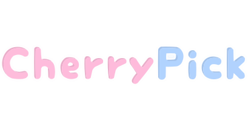

<div align="center">
  <a href="https://github.com/anxrch/egokey">
    
  </a>

  **EgoKey is a free, open-source, federated social-media platform.**

  [Repository](https://github.com/anxrch/egokey) · [Issues](https://github.com/anxrch/egokey/issues) · [Releases](https://github.com/anxrch/egokey/releases) · [Contributing](./CONTRIBUTING.md)
</div>

## EgoKey만의 기능

이 포크는 [CherryPick](https://github.com/kokonect-link/cherrypick) 기반이며, 아래 기능이 포크에서 추가·변경되었습니다.

| 기능 | 설명 |
| --- | --- |
| 뮤트한 사용자 숨기기 설정 | 계정 설정 하나로 뮤트한 사용자를 알림, 리액션한 사용자 목록, 관련 사용자 목록에서 숨길 수 있습니다. |
| 노트별 리노트 알림 뮤트 | "이 노트의 리노트 알림 뮤트"로 특정 노트의 리노트 알림만 골라 끌 수 있습니다. |
| 서버 기본 테마 모드 설정 | 관리자가 신규 사용자와 게스트에게 적용되는 서버 기본 테마 모드를 지정할 수 있습니다. |
| 첨부 미디어 미리보기 수정 | 첨부 미디어 미리보기가 표시되지 않던 버그를 수정했습니다. |
| 노트 액션 배치 개선 | 노트 액션이 콘텐츠 아래에 위치하도록 프런트엔드 레이아웃을 다듬었습니다. |
| 연합 테스트 개선 | 페디버스 연합 테스트 환경 구성과 사용자 테스트를 개선했습니다. |
| EgoKey 리브랜딩 | 제품 이름, 공개 메타데이터, 문서, 릴리스 아티팩트를 EgoKey로 리브랜딩했습니다. |
| GHCR 이미지 배포 | 릴리스/개발 컨테이너 이미지를 `ghcr.io/anxrch/egokey`에 배포합니다. |
| 미디어 프록시 User-Agent 정리 | 미디어 프록시가 EgoKey로 식별되는 User-Agent를 사용합니다. |

## Run EgoKey

For a production deployment, copy the supplied Docker configuration, set the instance URL and database credentials, then start the service with Docker Compose. The release image is published to `ghcr.io/anxrch/egokey`.

```sh
cp .config/docker_example.yml .config/default.yml
cp .config/docker_example.env .config/docker.env
cp compose_example.yml compose.yml
docker compose up -d
```

See [the configuration example](./.config/example.yml) for all available settings.

## Development

EgoKey requires Redis, PostgreSQL, and FFmpeg. The [contribution guide](./CONTRIBUTING.md) covers local setup, testing, and release expectations.

## Attribution and licensing

EgoKey is distributed under the AGPL-3.0-only license. See [COPYING](./COPYING) and the included third-party notices for complete licensing and attribution information.

---

## 레거시: 원래 CherryPick README

> 아래는 포크의 기반이 된 [CherryPick](https://github.com/kokonect-link/cherrypick)의 원래 README를 레거시로 보존한 것입니다. 브랜딩·링크·감사 표기는 CherryPick 기준으로 작성되었으므로 현재 내용과 다를 수 있습니다.

<div align="center">
<a href="https://misskey-hub.net">
	
</a>

**🌎 **CherryPick** is an open source, federated social media platform that's free forever! 🚀**

[Learn more](https://misskey-hub.net/)

---

<a href="https://misskey-hub.net/servers/">
		</a>

<a href="https://misskey-hub.net/docs/for-admin/install/guides/">
		</a>

<a href="./CONTRIBUTING.md">
		</a>

<a href="https://discord.gg/V8qghB28Aj">
		</a>

<a href="https://www.patreon.com/noridev">
		</a>

[](https://deepwiki.com/kokonect-link/cherrypick)

</div>

### Thanks

<a href="https://sentry.io/"></a>

Thanks to [Sentry](https://sentry.io/) for providing the error tracking platform that helps us catch unexpected errors.

<a href="https://www.chromatic.com/"></a>

Thanks to [Chromatic](https://www.chromatic.com/) for providing the visual testing platform that helps us review UI changes and catch visual regressions.

<a href="https://about.codecov.io/for/open-source/"></a>

Thanks to [Codecov](https://about.codecov.io/for/open-source/) for providing the code coverage platform that helps us improve our test coverage.

<a href="https://crowdin.com/"></a>

Thanks to [Crowdin](https://crowdin.com/) for providing the localization platform that helps us translate CherryPick into many languages.

<a href="https://hub.docker.com/"></a>

Thanks to [Docker](https://hub.docker.com/) for providing the container platform that helps us run CherryPick in production.
